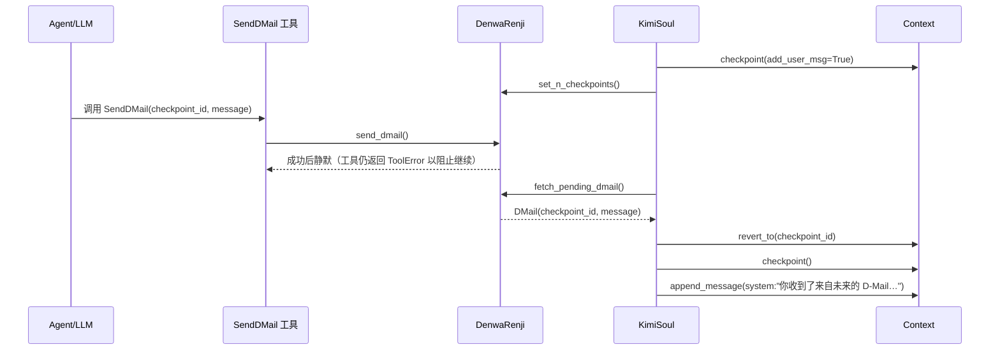

# 时间旅行代理学习指南

本指南面向第一次接触 Kimi CLI 时间旅行（D-Mail）机制的开发者，帮助你理解 *为什么* 需要 D-Mail、*底层组件* 如何协同、以及 *如何在实战中安全启用*。

> **术语约定**  
> - **D-Mail**：通过 `SendDMail` 工具发送给“过去自己的”消息。  
> - **Checkpoint / 检查点**：`Context` 记录的状态快照。  
> - **DenwaRenji**：负责排队 D-Mail 的“电话微波炉”调度器。  
> - **BackToTheFuture**：`KimiSoul` 用来触发回滚的内部异常。

## 1. 时间旅行的动机

在长会话或多工具调用的场景，LLM 容易被无关上下文淹没：

- 读到超大文件后才发现只需其中一段。
- 多轮搜索后才找准关键词。
- 代码迭代失败，想直接把“正确做法”告诉更早的自己。

D-Mail 允许你把“最有价值的经验”向前广播：

1. 选择一个 `CHECKPOINT {id}` 作为回放目标。
2. 写一封只面向 Agent 自己的 D-Mail，告诉它“哪些步骤可以省略、哪些结论已经验证”。
3. 系统会丢弃该检查点之后的全部上下文，再附加你的 D-Mail，使 Agent 以更短的历史继续任务。

## 2. 核心组件拆解

| 组件 | 文件 | 作用 | 关键约束 |
| --- | --- | --- | --- |
| `Context` | `src/kimi_cli/soul/context.py` | 维护消息历史、token 统计与检查点文件（JSONL） | `checkpoint()` 会生成 `_checkpoint` 标记并可选写入 `<system>CHECKPOINT {id}`；`revert_to()` 通过旋转文件实现回滚，但 **不会恢复磁盘代码**。 |
| `DenwaRenji` | `src/kimi_cli/soul/denwarenji.py` | 校验 checkpoint ID、存放唯一的待发送 D-Mail | 仅允许 1 封待处理 D-Mail；`checkpoint_id` 必须满足 `0 ≤ id < n_checkpoints`。|
| `SendDMail` | `src/kimi_cli/tools/dmail/__init__.py` | LLM 工具接口；成功时实际不会返回 | 若发送失败（如 ID 越界、并发 D-Mail），返回 `ToolError` 提示原因；若同一轮其他需要审批的工具被拒绝，D-Mail 也会作废。|
| `KimiSoul` | `src/kimi_cli/soul/kimisoul.py` | 主循环：每步前创建检查点、同步 `n_checkpoints`、捕获 `BackToTheFuture` | 当检测到挂起 D-Mail 时抛出 `BackToTheFuture`，上层捕获后回滚并把“来自未来的系统消息”插入上下文。 |

## 3. 执行链路

要点：

1. **成功的 SendDMail 依然返回 `ToolError`**，因为当帧随即被 `BackToTheFuture` 打断，不会再继续执行当前步骤。
2. **文件系统不会回滚**：`Context.revert_to` 只处理对话 JSONL，`TODO` 提示未来才可能增加文件状态管理。编写 D-Mail 时应提醒“代码文件已经改过，请勿重复”。
3. **审批互斥**：若同一轮里任意工具被用户拒绝，`kimi_soul` 会清空挂起 D-Mail（防止在“被否决”的世界线回去）。

## 4. 实战策略

### 4.1 选择正确的 Checkpoint

- 关注 `<system>CHECKPOINT {id}</system>`，通常每个 Agent 步骤前都会生成一个。
- 如果需要撤销最近的若干探索，选择执行探索前的 ID。
- 若 checkpoint 数量太少，说明代理尚未走到需要回滚的位置，先继续推进。

### 4.2 撰写高质量 D-Mail

- **只与自己对话**：告诉过去的自己“我已经读过 `xxx.py` 第 120-200 行，有效信息是……”。
- **明确下一步**：例如“直接复制以下修正函数，不要再次 run tests”。
- **指出副作用**：若对磁盘做了修改（写文件、安装依赖），必须告知以免重复。

### 4.3 常见模式

1. **超大文件裁剪**：阅读 `log.txt` 后仅保留关键片段，发送 D-Mail 提示“无需再 cat 全部文件，只看以下段落”。
2. **搜索重启**：连续三次网页搜索失败，通过 D-Mail 告诉过去的自己换用“error message + stacktrace”关键字。
3. **修复回传**：多轮调试后拿到最终补丁，把 patch 附在 D-Mail，指导过去的自己直接应用。

## 5. 学习路径与实验

1. **阅读源码**：按顺序研究 `Context -> DenwaRenji -> SendDMail -> KimiSoul.BackToTheFuture`，对照本指南做笔记。
2. **运行测试**：完成 `tests/test_time_travel_agent.py`（需自己实现）后，执行 `uv run pytest tests/test_time_travel_agent.py -vv`，观察断言与日志。
3. **写一个自定义 Agent**：在 `src/kimi_cli/agents/default/system.md` 中追加“何时考虑发送 D-Mail”的提示，将工具加入 `agents/default/agent.yaml` 的 `tools` 列表以启用。

## 6. 限制与未来方向

- **单封限制**：`DenwaRenji` 只允许运行时有一封待处理 D-Mail，暂不支持队列。
- **无磁盘回滚**：`# TODO: allow restoring filesystem state to the checkpoint` 尚未实现，回滚后需要自行确保代码与文档一致。
- **审批耦合**：工具审批拒绝会清除 D-Mail，复杂任务请提前沟通用户操作流程。
- **缺少 UI 反馈**：当前命令行不会直接展示“回到了哪一个 checkpoint”，只能靠 `<system>` 消息推断。

> ✅ 建议在学习/演示环境中先启用 D-Mail 工具与相关测试，再尝试在真实项目中依赖该机制。
